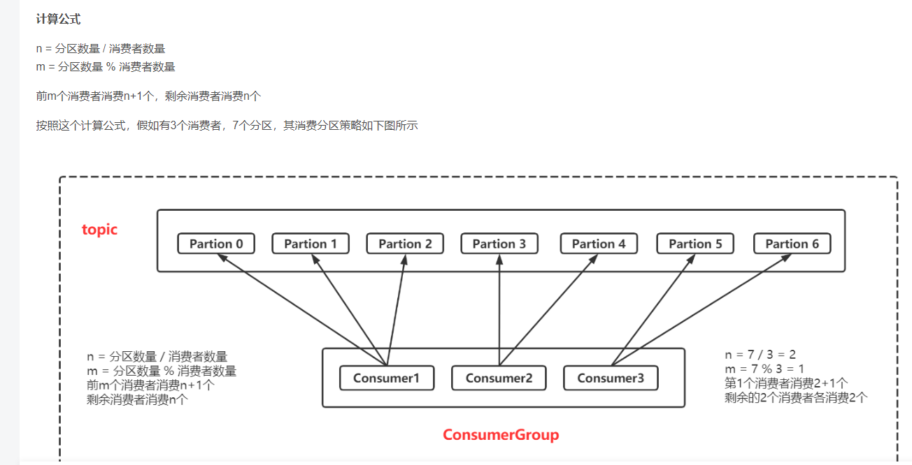
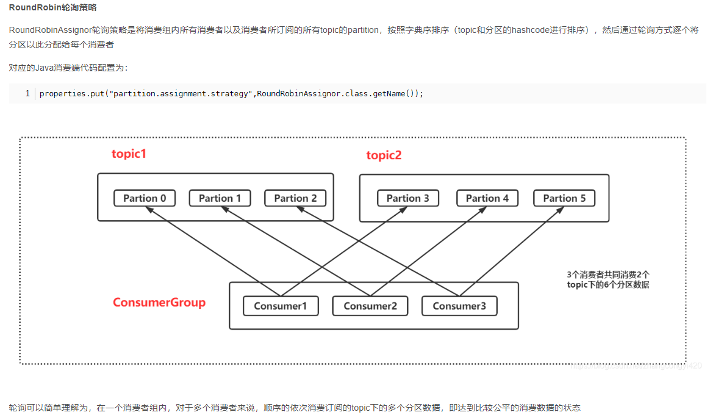
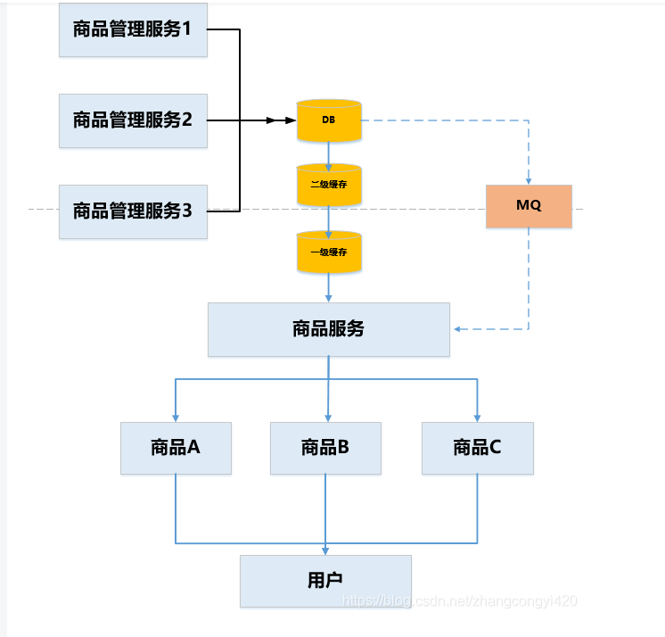

windows 配置kafka  https://www.cnblogs.com/coloz/p/10487679.html

学习kafka地址： https://blog.csdn.net/zhangcongyi420/article/details/89282748

kafka 常用命令： https://blog.csdn.net/zhangcongyi420/article/details/106265247

消费者分区分配策略

1.range范围分配策略

    
2.roundRobin轮询策略

3.stricky 粘性分配策略【顾名思义，相比roundRobin轮询策略，尚存活的consumer会保留原先的消费分区，挂了的consumer剩下的分区依次分配给存货的consumer，减少了系统开销】

# 使用kafka进行商品维度化缓存解决方案
商品微服务架构如下

后台管理员调整商品价格后，请求修改商品价格的接口，修改完毕后，商品服务通过消息队列感知到并刷新商品的最新信息到页面上

商品管理服务修改了价格后，发送消息通知商品服务，商品服务收到消息后，立即去拉取最新的商品信息，然后重新放到缓存中【可使用ehcache和redis二级缓存】

# kafuka生产者 配置详解
# 高优先级配置
# 以逗号分隔的主机：端口对列表，用于建立与Kafka群集的初始连接
spring.kafka.producer.bootstrap-servers=TopKafka1:9092,TopKafka2:9092,TopKafka3:9092

# 设置大于0的值将使客户端重新发送任何数据，一旦这些数据发送失败。注意，这些重试与客户端接收到发送错误时的重试没有什么不同。允许重试将潜在的改变数据的顺序，如果这两个消息记录都是发送到同一个partition，则第一个消息失败第二个发送成功，则第二条消息会比第一条消息出现要早。
spring.kafka.producer.retries=0

# 每当多个记录被发送到同一分区时，生产者将尝试将记录一起批量处理为更少的请求，
# 这有助于提升客户端和服务端之间的性能，此配置控制默认批量大小（以字节为单位），默认值为16384
spring.kafka.producer.batch-size=16384

# producer可以用来缓存数据的内存大小。如果数据产生速度大于向broker发送的速度，producer会阻塞或者抛出异常，以“block.on.buffer.full”来表明。这项设置将和producer能够使用的总内存相关，但并不是一个硬性的限制，因为不是producer使用的所有内存都是用于缓存。一些额外的内存会用于压缩（如果引入压缩机制），同样还有一些用于维护请求。
spring.kafka.producer.buffer-memory=33554432

# key的Serializer类，实现了org.apache.kafka.common.serialization.Serializer接口
spring.kafka.producer.key-serializer=org.apache.kafka.common.serialization.StringSerializer

# 值的Serializer类，实现了org.apache.kafka.common.serialization.Serializer接口
spring.kafka.producer.value-serializer=org.apache.kafka.common.serialization.StringSerializer

# procedure要求leader在考虑完成请求之前收到的确认数，用于控制发送记录在服务端的持久化，其值可以为如下：
# acks = 0 如果设置为零，则生产者将不会等待来自服务器的任何确认，该记录将立即添加到套接字缓冲区并视为已发送。在这种情况下，无法保证服务器已收到记录，并且重试配置将不会生效（因为客户端通常不会知道任何故障），为每条记录返回的偏移量始终设置为-1。
# acks = 1 这意味着leader会将记录写入其本地日志，但无需等待所有副本服务器的完全确认即可做出回应，在这种情况下，如果leader在确认记录后立即失败，但在将数据复制到所有的副本服务器之前，则记录将会丢失。
# acks = all 这意味着leader将等待完整的同步副本集以确认记录，这保证了只要至少一个同步副本服务器仍然存活，记录就不会丢失，这是最强有力的保证，这相当于acks = -1的设置。
# 可以设置的值为：all, -1, 0, 1
spring.kafka.producer.acks=-1

# 当向server发出请求时，这个字符串会发送给server。目的是能够追踪请求源头，以此来允许ip/port许可列表之外的一些应用可以发送信息。这项应用可以设置任意字符串，因为没有任何功能性的目的，除了记录和跟踪
spring.kafka.producer.client-id=1

# producer用于压缩数据的压缩类型。默认是无压缩。正确的选项值是none、gzip、snappy。压缩最好用于批量处理，批量处理消息越多，压缩性能越好
spring.kafka.producer.compression-type=none

# 中优先级配置
以毫秒为单位的时间，是在我们强制更新metadata的时间间隔。即使我们没有看到任何partition leadership改变。默认值：5 * 60 * 1000 = 300000

spring.kafka.producer.properties.metadata.max.age.ms=300000

# producer组将会汇总任何在请求与发送之间到达的消息记录一个单独批量的请求。通常来说，这只有在记录产生速度大于发送速度的时候才能发生。然而，在某些条件下，客户端将希望降低请求的数量，甚至降低到中等负载一下。这项设置将通过增加小的延迟来完成–即，不是立即发送一条记录，producer将会等待给定的延迟时间以允许其他消息记录发送，这些消息记录可以批量处理。这可以认为是TCP种Nagle的算法类似。这项设置设定了批量处理的更高的延迟边界：一旦我们获得某个partition的batch.size，他将会立即发送而不顾这项设置，然而如果我们获得消息字节数比这项设置要小的多，我们需要“linger”特定的时间以获取更多的消息。 这个设置默认为0，即没有延迟。设定linger.ms=5，例如，将会减少请求数目，但是同时会增加5ms的延迟。
spring.kafka.producer.properties.linger.ms=0

# 发送数据时的缓存空间大小，默认：128 * 1024 = 131072
spring.kafka.producer.properties.send.buffer.bytes=131072

# socket的接收缓存空间大小,当阅读数据时使用，默认：32 * 1024 = 32768
spring.kafka.producer.properties.receive.buffer.bytes=32768

# 请求的最大字节数。这也是对最大记录尺寸的有效覆盖。注意：server具有自己对消息记录尺寸的覆盖，这些尺寸和这个设置不同。此项设置将会限制producer每次批量发送请求的数目，以防发出巨量的请求。默认：1 * 1024 * 1024 = 1048576
spring.kafka.producer.properties.max.request.size=1048576

# 连接失败时，当我们重新连接时的等待时间。这避免了客户端反复重连，默认值：50
spring.kafka.producer.properties.reconnect.backoff.ms=50

# producer客户端连接一个kafka服务（broker）失败重连的总时间，每次连接失败，重连时间都会指数级增加，每次增加的时间会存在20%的随机抖动，以避免连接风暴。默认：1000
# spring.kafka.producer.properties.reconnect.backoff.max.ms=1000

# 控制block的时长,当buffer空间不够或者metadata丢失时产生block，默认：60 * 1000 = 60000
spring.kafka.producer.properties.max.block.ms=60000

# 在试图重试失败的produce请求之前的等待时间。避免陷入发送-失败的死循环中，默认：100
spring.kafka.producer.properties.retry.backoff.ms=100

# metrics系统维护可配置的样本数量，在一个可修正的window size。这项配置配置了窗口大小，例如。我们可能在30s的期间维护两个样本。当一个窗口退出后，我们会擦除并重写最老的窗口，默认：30000
spring.kafka.producer.properties.metrics.sample.window.ms=30000

# 用于维护metrics的样本数，默认：2
spring.kafka.producer.properties.metrics.num.samples=2

# 用于metrics的最高纪录等级。
# spring.kafka.producer.properties.metrics.recording.level=Sensor.RecordingLevel.INFO.toString()

# 类的列表，用于衡量指标。实现MetricReporter接口，将允许增加一些类，这些类在新的衡量指标产生时就会改变。JmxReporter总会包含用于注册JMX统计
#spring.kafka.producer.properties.metric.reporters=Collections.emptyList()

# kafka可以在一个connection中发送多个请求，叫作一个flight,这样可以减少开销，但是如果产生错误，可能会造成数据的发送顺序改变,默认是5 (修改）
spring.kafka.producer.properties.max.in.flight.requests.per.connection=5

# 关闭连接空闲时间，默认：9 * 60 * 1000 = 540000
spring.kafka.producer.properties.connections.max.idle.ms=540000

# 分区类，默认：org.apache.kafka.clients.producer.internals.DefaultPartitioner
spring.kafka.producer.properties.partitioner.class=org.apache.kafka.clients.producer.internals.DefaultPartitioner

# 客户端将等待请求的响应的最大时间,如果在这个时间内没有收到响应，客户端将重发请求;超过重试次数将抛异常，默认：30 * 1000 = 30000
spring.kafka.producer.properties.request.timeout.ms=30000

# 用户自定义interceptor。
#spring.kafka.producer.properties.interceptor.classes=none

# 是否使用幂等性。如果设置为true，表示producer将确保每一条消息都恰好有一份备份；如果设置为false，则表示producer因发送数据到broker失败重试使，可能往数据流中写入多分重试的消息。
#spring.kafka.producer.properties.enable.idempotence=false

# 在主动中止正在进行的事务之前，事务协调器将等待生产者的事务状态更新的最长时间（以ms为单位）。
#spring.kafka.producer.properties.transaction.timeout.ms=60000

# 用于事务传递的TransactionalId。 这使得可以跨越多个生产者会话的可靠性语义，因为它允许客户端保证在开始任何新事务之前使用相同的TransactionalId的事务已经完成。 如果没有提供TransactionalId，则生产者被限制为幂等传递。请注意，如果配置了TransactionalId，则必须启用enable.idempotence。默认值为空，这意味着无法使用事务。
#spring.kafka.producer.properties.transactional.id=null

#连接风暴
应用启动的时候，经常可能发生各应用服务器的连接数异常飙升的情况。假设连接数的设置为：min值3,max值10，正常的业务使用连接数在5个左右，当重启应用时，各应用连接数可能会飙升到10个，瞬间甚至还有可能部分应用会报取不到连接。启动完成后接下来的时间内，连接开始慢慢返回到业务的正常值。这就是所谓的连接风暴。

# kafuka消费者配置详解

#重要配置
# 以逗号分隔的主机：端口对列表，用于建立与Kafka群集的初始连接
spring.kafka.consumer.bootstrap-servers=TopKafka1:9092,TopKafka2:9092,TopKafka3:9092

# 用来唯一标识consumer进程所在组的字符串，如果设置同样的group id，表示这些processes都是属于同一个consumer group，默认：""
spring.kafka.consumer.group-id=TyyLoveZyy

# max.poll.records条数据需要在session.timeout.ms这个时间内处理完，默认：500
spring.kafka.consumer.max-poll-records=500

# 消费超时时间，大小不能超过session.timeout.ms，默认：3000
spring.kafka.consumer.heartbeat-interval=3000

# 如果为真，consumer所fetch的消息的offset将会自动的同步到zookeeper。这项提交的offset将在进程挂掉时，由新的consumer使用，默认：true
spring.kafka.consumer.enable-auto-commit=true

# consumer自动向zookeeper提交offset的频率，默认：5000
spring.kafka.consumer.auto-commit-interval=5000

# 没有初始化的offset时，可以设置以下三种情况：（默认：latest）
# earliest
# 当各分区下有已提交的offset时，从提交的offset开始消费；无提交的offset时，从头开始消费
# latest
# 当各分区下有已提交的offset时，从提交的offset开始消费；无提交的offset时，消费新产生的该分区下的数据
# none
# topic各分区都存在已提交的offset时，从offset后开始消费；只要有一个分区不存在已提交的offset，则抛出异常
spring.kafka.consumer.auto-offset-reset=earliest

# 每次fetch请求时，server应该返回的最小字节数。如果没有足够的数据返回，请求会等待，直到足够的数据才会返回。默认：1
spring.kafka.consumer.fetch-min-size=1

# Fetch请求发给broker后，在broker中可能会被阻塞的（当topic中records的总size小于fetch.min.bytes时），此时这个fetch请求耗时就会比较长。这个配置就是来配置consumer最多等待response多久。
spring.kafka.consumer.fetch-max-wait=500

# 消费者进程的标识。如果设置一个人为可读的值，跟踪问题会比较方便。。默认：""
spring.kafka.consumer.client-id=1

# key的反序列化类。实现了org.apache.kafka.common.serialization.Deserializer接口
spring.kafka.consumer.key-deserializer=org.apache.kafka.common.serialization.StringDeserializer

# 值的反序列化类。实现了org.apache.kafka.common.serialization.Deserializer接口
spring.kafka.consumer.value-deserializer=org.apache.kafka.common.serialization.StringDeserializer

#其他配置

# consumer是通过拉取的方式向服务端拉取数据，当超过指定时间间隔max.poll.interval.ms没有向服务端发送poll()请求，而心跳heartbeat线程仍然在继续，会认为该consumer锁死，就会将该consumer退出group，并进行再分配。默认：300000
spring.kafka.consumer.properties.max.poll.interval.ms=300000

# 会话的超时限制。如果consumer在这段时间内没有发送心跳信息，则它会被认为挂掉了，并且reblance将会产生，必须在[group.min.session.timeout.ms, group.max.session.timeout.ms]范围内。默认：10000
spring.kafka.consumer.properties.session.timeout.ms=10000

# 在“range”和“roundrobin”策略之间选择一种作为分配partitions给consumer 数据流的策略； 循环的partition分配器分配所有可用的partitions以及所有可用consumer 线程。它会将partition循环的分配到consumer线程上。如果所有consumer实例的订阅都是确定的，则partitions的划分是确定的分布。循环分配策略只有在以下条件满足时才可以：（1）每个topic在每个consumer实例上都有同样数量的数据流。（2）订阅的topic的集合对于consumer group中每个consumer实例来说都是确定的。
spring.kafka.consumer.properties.partition.assignment.strategy=range

# 一次fetch请求，从一个broker中取得的records最大大小。如果在从topic中第一个非空的partition取消息时，如果取到的第一个record的大小就超过这个配置时，仍然会读取这个record，也就是说在这片情况下，只会返回这一条record。默认：50 * 1024 * 1024 = 52428800
spring.kafka.consumer.properties.fetch.max.bytes=52428800

# Metadata数据的刷新间隔。即便没有任何的partition订阅关系变更也能执行。默认：5 * 60 * 1000 = 300000
spring.kafka.consumer.properties.metadata.max.age.ms=300000

# 一次fetch请求，从一个partition中取得的records最大大小。如果在从topic中第一个非空的partition取消息时，如果取到的第一个record的大小就超过这个配置时，仍然会读取这个record，也就是说在这片情况下，只会返回这一条record。broker、topic都会对producer发给它的message size做限制。所以在配置这值时，可以参考broker的message.max.bytes 和 topic的max.message.bytes的配置。默认：1 * 1024 * 1024 = 1048576
spring.kafka.consumer.properties.max.partition.fetch.bytes=1048576

# 最大发送的TCP大小。默认：128 * 1024 = 131072，如果设置为 -1 则为操作系统默认大小
spring.kafka.consumer.properties.send.buffer.bytes=131072

# 消费者接受缓冲区的大小。这个值在创建Socket连接时会用到。取值范围是：[-1, Integer.MAX]。默认值是：65536 （64 KB），如果值设置为-1，则会使用操作系统默认的值。默认：64 * 1024 = 65536
spring.kafka.consumer.properties.receive.buffer.bytes=65536

# 连接失败时，当我们重新连接时的等待时间。这避免了客户端反复重连，默认：50
spring.kafka.consumer.properties.reconnect.backoff.ms=50

# producer客户端连接一个kafka服务（broker）失败重连的总时间，每次连接失败，重连时间都会指数级增加，每次增加的时间会存在20%的随机抖动，以避免连接风暴。默认：1000
spring.kafka.consumer.properties.reconnect.backoff.max.ms=1000

# 在试图重试失败的produce请求之前的等待时间。避免陷入发送-失败的死循环中，默认：100
spring.kafka.consumer.properties.retry.backoff.ms=100

# metrics系统维护可配置的样本数量，在一个可修正的window size。这项配置配置了窗口大小，例如。我们可能在30s的期间维护两个样本。当一个窗口退出后，我们会擦除并重写最老的窗口，默认：30000
spring.kafka.consumer.properties.metrics.sample.window.ms=30000

# 用于维护metrics的样本数，默认：2
spring.kafka.consumer.properties.metrics.num.samples=2

# 用于metrics的最高纪录等级。默认：Sensor.RecordingLevel.INFO.toString()
#spring.kafka.consumer.properties.metrics.recording.level=Sensor.RecordingLevel.INFO.toString()

# 类的列表，用于衡量指标。实现MetricReporter接口，将允许增加一些类，这些类在新的衡量指标产生时就会改变。JmxReporter总会包含用于注册JMX统计。默认：Collections.emptyList()
#spring.kafka.consumer.properties.metric.reporters=Collections.emptyList()

# 自动检查所消耗记录的CRC32。这可以确保没有线上或磁盘损坏的消息发生。此检查会增加一些开销，因此在寻求极高性能的情况下可能会被禁用。默认：true
spring.kafka.consumer.properties.check.crcs=true

# 连接空闲超时时间。因为consumer只与broker有连接（coordinator也是一个broker），所以这个配置的是consumer到broker之间的。默认：9 * 60 * 1000 = 540000
spring.kafka.consumer.properties.connections.max.idle.ms=540000

# 客户端将等待请求的响应的最大时间,如果在这个时间内没有收到响应，客户端将重发请求;超过重试次数将抛异常，默认：30000
spring.kafka.consumer.properties.request.timeout.ms=30000

# 用于阻止的KafkaConsumer API的默认超时时间。KIP还为这样的阻塞API添加了重载，以支持指定每个阻塞API使用的特定超时，而不是使用default.api.timeout.ms设置的默认超时。特别是，添加了一个新的轮询（持续时间）API，它不会阻止动态分区分配。旧的poll（long）API已被弃用，将在以后的版本中删除。还为其他KafkaConsumer方法添加了重载，例如partitionsFor，listTopics，offsetsForTimes，beginningOffsets，endOffsets和close，它们接收持续时间。默认：60 * 1000 = 60000
spring.kafka.consumer.properties.default.api.timeout.ms=60000

# 用户自定义interceptor。默认：Collections.emptyList()
#spring.kafka.consumer.properties.interceptor.classes=Collections.emptyList()

# 是否将内部topics的消息暴露给consumer。默认：true
spring.kafka.consumer.properties.exclude.internal.topics=true

# 默认：true
spring.kafka.consumer.properties.internal.leave.group.on.close=true

# 默认：IsolationLevel.READ_UNCOMMITTED.toString().toLowerCase(Locale.ROOT)
#spring.kafka.consumer.properties.isolation.level=IsolationLevel.READ_UNCOMMITTED.toString().toLowerCase(Locale.ROOT)