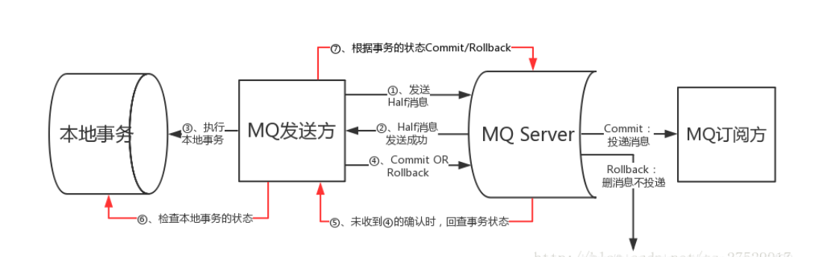

#rocketMq 学习地址
https://blog.csdn.net/zhangcongyi420/article/details/105931835

事务消息状态图：
1.producer 发送半消息
2.Mq服务器接受到消息，但发送异常未能到消费端，回执producer 半消息发送成功
3.执行本地事务
4.producer 收到半消息信息触发 事务 commit或者rollback  （成功则rollback,删消息不投递）
5.若 Mq服务器未收到 事务回滚则 触发producer回查事务状态
6.producer检查本地事务状态

#RokcetMq实现分布式事务
交互流程：
1.bank1向MQ server发送转账消息
2.bank1执行本地事务，扣减金额
3.bank2接受消息，执行本地事务，添加金额

具体流程如下：
1.用户A【消息生产者】 首先发送一条事务消息到rocketMq【这里发送到MQ的broker】
2.发送成功后，broker会返回给本地事务一个通知【图中第2步】，如果成功发送到broker，本地事务收到通知执行DB操作【图中第3步】，即扣减账余额
3.本地事务执行成功后，通知borker【图中第4步】，此时broker将原来的消息变为可消费状态，即对consumer可见
4.消费者消费消息，并执行本地事务

事务消息流程2：

