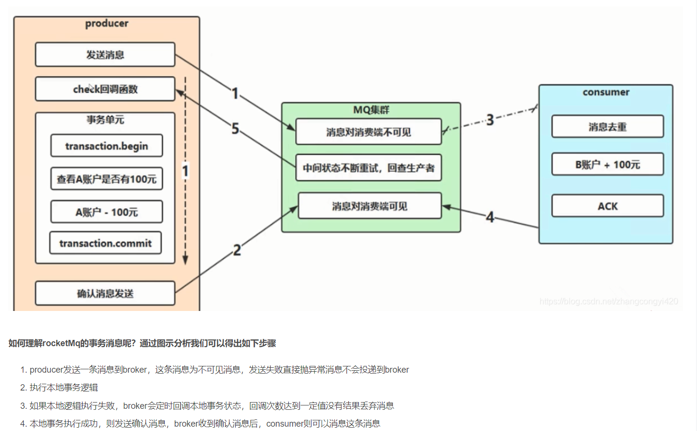

事务消息状态图：
1.producer 发送半消息
2.Mq服务器接受到消息，但发送异常未能到消费端，回执producer 半消息发送成功
3.执行本地事务
4.producer 收到半消息信息触发 事务 commit或者rollback  （成功则rollback,删消息不投递）
5.若 Mq服务器未收到 事务回滚则 触发producer回查事务状态
6.producer检查本地事务状态

事务消息流程2：

