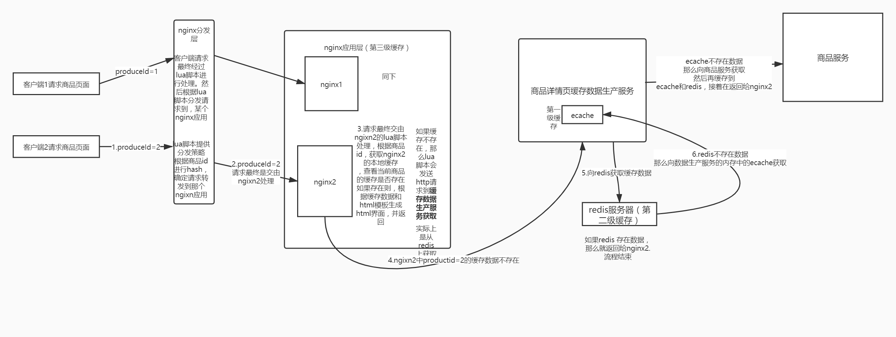
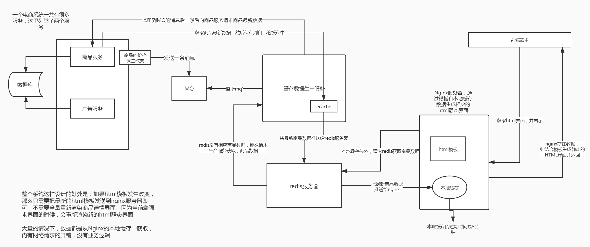

地址： https://blog.csdn.net/qq_26222859/article/details/53144277?spm=1001.2101.3001.6650.1&utm_medium=distribute.pc_relevant.none-task-blog-2%7Edefault%7ECTRLIST%7ERate-1-53144277-blog-89282748.pc_relevant_antiscanv2&depth_1-utm_source=distribute.pc_relevant.none-task-blog-2%7Edefault%7ECTRLIST%7ERate-1-53144277-blog-89282748.pc_relevant_antiscanv2&utm_relevant_index=2

商品详情页缓存数据生产服务的工作流程分析

（1）监听多个kafka topic，每个kafka topic对应一个服务（简化一下，监听一个kafka topic）
（2）如果一个服务发生了数据变更，那么就发送一个消息到kafka topic中
（3）缓存数据生产服务监听到了消息以后，就发送请求到对应的服务中调用接口以及拉取数据，此时是从mysql中查询的。
（4）缓存数据生产服务拉取到了数据之后，会将数据在本地缓存中写入一份，就是ehcache中。（一级缓存）（防止redis二级缓存失效，所有请求打到数据库）
（5）同时会将数据在redis中写入一份。（二级缓存）

这个时候，你会发现，我们上面说的只是实现了两层的缓存，不是说有三层缓存么？那么第三层是什么呢？第三级缓存是，nginx。
那么nginx的第三级缓存怎么做呢？
采用双层的架构：分发层+应用层，双层nginx

分发层nginx，负责流量分发的逻辑和策略，这个里面它可以根据你自己定义的一些规则，比如根据productId去进行hash，然后对后端的nginx数量取模。

​ 将某一个商品的访问的请求，就固定路由到一个nginx后端服务器上去，保证说只会从redis中获取一次缓存数据，后面全都是走nginx本地缓存了。

​ 后端的nginx服务器，就称之为应用服务器; 最前端的nginx服务器，被称之为分发服务器。

​ 看似很简单，其实很有用，在实际的生产环境中，可以大幅度提升你的nginx本地缓存这一层的命中率，大幅度减少redis后端的压力，提升性能。

​ 如果没有分发层，我们想象一下，会怎么样？可能多个对同一个商品id的请求，会分别落到不同的nginx上面，那么这样就会造成，没有高效的利用之前已经从redis获取并缓存到nginx上的商品信息。也就是说会造成多个nginx上面都会有同一份商品信息，这样造成了资源浪费和命中率的下降。

​ 所以我们需要将多同样的商品id的请求，以后都落到同个nginx，那么只需要首次去redis请求商品信息，并缓存到当前nginx，以后同样的商品id的请求，都可以直接命中nginx中首次获取的商品信息。那么分发层的作用就体现在这里了

整个三级缓存的架构如下（假设nginx1是分发层，nginx2和nginx3是应用层）。

存在问题
（1）当部署多个缓存数据生产服务，假设商品服务修改了商品信息，那么就会发送一个更新请求给mq，那么多个缓存数据生产服务就会收到消息，那么这几个服务，都会对redis和ecache进行更新。那么问题来了，可能就会存在旧数据被新数据覆盖问题，而且还有个问题那就是同一个mq更新请求，多个服务重复的进行了redis和ecache更新。

（2）这里还有个问题：就是如果你的数据在nginx -> redis -> ehcache三级缓存都不在了，可能就是被LRU（因为nginx、reddis、ehcache是会有策略进行数据清理的，当内存你不够用时，就会根据lru策略进行清理）清理掉了。

这个时候缓存服务会重新去商品服务拉数据，然后再去更新到ehcache和redis中。

这个过程就是缓存重建的过程

那么在这个过程也会有上面问题1的问题。

那么怎么解决上诉两个问题呢？

使用分布式锁，来解决，在同一个时刻，对于同一个商品的更新redis和ehcache只有一个线程执行。其他线程等待锁。

​ 每次更新需要比对一下已有的Redis数据的版本，跟自己要更新的数据的版本【数据库中的数据有一个版本字段，比如version】，那个是最新的，如果不是最新的那么放弃更新，如果是最新的则更新。

通过分布式锁和数据版本，来控制新旧数据的覆盖问题和多个线程更新缓存的问题。

（3）问题3，如果查询的redis和ehcache都不存在，那么怎么取请求商品服务获取数据呢？如果多个线程同时访问，那么怎么解决多个请求都打到商品服务的问题呢？

其实也可以使用加分布式锁的形式。

其他问题：
1.缓存冷启动问题怎么解决【第一次项目启动，缓存中数据不存在，所以核心就是，redis中不存在数据，所有请求都会打到mysql。】？ - 缓存预热
